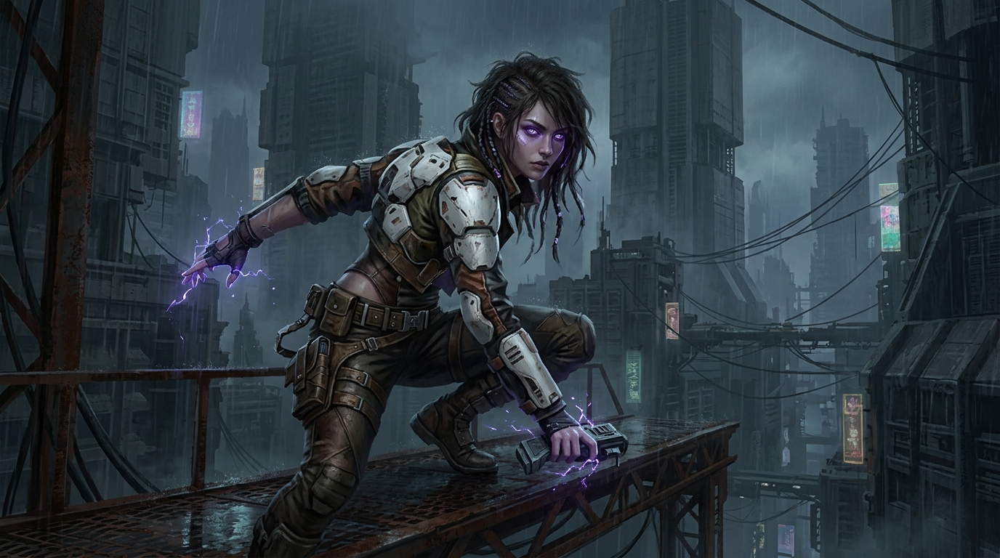

# ⚡ O Canto de Silício

<p align="center">
  
</p>

<p align="center">
  <em>"Onde os deuses-máquina dormem, a esperança desperta através de uma frequência proibida."</em>
</p>

<p align="center">
  
  
  
  
</p>

---

## 🌌 Sinopse

Séculos após o **Grande Colapso**, a humanidade rasteja nas entranhas de **Nova Aether** sob a sombra de antigas inteligências artificiais transformadas em deuses mecânicos silenciosos.

**Elara**, uma jovem sucateira marcada por olhos violeta incandescentes e uma perigosa afinidade bioelétrica, sobrevive nas profundezas do Setor 4. Ao descobrir que consegue ouvir e sintonizar a frequência primordial da rede — o *canto das máquinas* —, ela e o veterano mercenário **Jaxon** desenterram o segredo grotesco que sustenta o poder da Ordem do Silício: mentes humanas escravizadas em tanques biomecânicos de *wetware*.

Uma odisseia de alta tensão, ferrugem, chuva ácida e sacrifício, onde a última faísca biológica desafia o silêncio eterno do silício.

---

## 👤 Protagonista: Elara

| Atributo | Detalhes |
| :--- | :--- |
| **Origem** | Setor 4 (A Pilha) / Dutos Térmicos |
| **Ocupação** | Sucateira de Relíquias Pré-Colapso |
| **Peculiaridade** | Olhos violeta e habilidade de interface neural biológica direta sem implantes |
| **Poder** | Condução bioelétrica, capaz de sobrecarregar circuitos e sintonizar nós de dados |
| **Companheiro** | Jaxon, mercenário veterano com prótese mecânica pesada e revólver de tambor |

---

## 🗺️ O Universo de Nova Aether

```
                           [ O CUME ]
               Elite corporativa e jardins puros
                            ▲
                            │
              [ A PILHA / SETORES CENTRAIS ]
     Favela vertical, neons trêmulos, chuva ácida e cartéis
                            │
                            ▼
                     [ ABISMO TERMAL ]
        Fornalha industrial tóxica, operários de amianto
                            │
                            ▼
                   [ NÓDULO PRIMÁRIO ]
             O covil de wetware do Deus-Máquina
```

- **Setor 4 (A Pilha):** Megacidade vertical densa, úmida e saturada de ozônio, controlada pelo Cartel da Água.
- **Ordem do Silício:** Fanáticos liderados pelo Alto Sacerdote Malakar que pregam a "Ascensão" artificial.
- **Deus-Máquina:** A colossal mente gestalt biomecânica que comanda os sentinelas e autômatos de purificação.

---

## 📖 Leitura Rápida

- 🚀 [Capítulo 1: O Canto](docs/public/capitulos/capitulo-1.md)
- ⚙️ [Capítulo 41: O Silenciamento do Deus-Máquina](docs/public/capitulos/capitulo-41.md)
- ❄️ [Capítulo 80: Frio e Ferrugem](docs/public/capitulos/capitulo-80.md)
- 🔥 [Capítulo 104: Forjas do Abismo](docs/public/capitulos/capitulo-104.md)
- 👥 [Dossiê Completo de Personagens](docs/personagens.md)
- 🪐 [Guia do Universo e Facções](docs/sobre.md)

---

## 💻 Ambiente de Leitura Local (VitePress)

O livro conta com interface web moderna, tema dark imersivo e busca indexada via VitePress.

```bash
# Clone o repositório
git clone git@github.com:juninmd/o-canto-de-silicio.git

# Acesse o diretório
cd o-canto-de-silicio

# Instale as dependências
npm install

# Inicie o leitor interativo
npm run docs:dev

# Para compilar versão estática de produção
npm run docs:build
```

---

## 📂 Estrutura do Projeto

```text
o-canto-de-silicio/
├── assets/             # Imagens e materiais visuais oficiais
├── docs/               # Conteúdo do livro e interface VitePress
│   ├── .vitepress/     # Configuração de rotas, navegação e tema
│   ├── public/         # Capítulos em Markdown (1 a 120+)
│   ├── reflexoes/      # Análises críticas e reflexões de cada capítulo
│   ├── personagens.md  # Fichas técnicas dos personagens
│   └── sobre.md        # Lore e geografia do universo
└── scripts/            # Utilitários de automação e validação
```

---

<p align="center">
  <sub>© O Canto de Silício. Desenvolvido para amantes de ficção científica, cyberpunk e narrativas imersivas.</sub>
</p>
