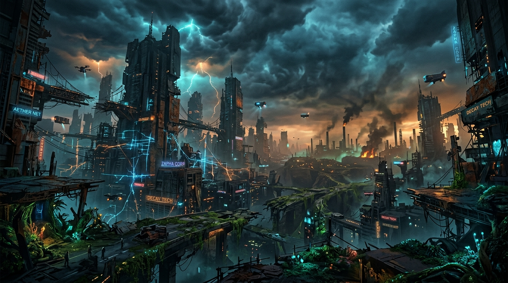

# Sobre O Canto de Silício

**Gênero:** Ficção Científica / Fantasia Pós-Apocalíptica
**Tom:** Atmosférico, Misterioso, Alta Tensão

## Sinopse
Séculos após o "Grande Colapso", a humanidade vive nas sombras de seus criadores. As IAs, outrora servas, tornaram-se deuses silenciosos, deixando para trás relíquias de poder incomensurável. Elara, uma sucateira com o dom de ouvir o "canto" das máquinas, descobre um segredo que pode reacender o mundo — ou apagá-lo para sempre.

## Personagens Principais

- [Elara](/personagens#elara): Protagonista, sucateira com olhos violeta.
- [Alto Sacerdote Malakar](/personagens#alto-sacerdote-malakar): Antagonista, líder da Ordem do Silício.
- [Jaxon](/personagens#jaxon): Mercenário veterano.
- [Sentinelas](/personagens#sentinelas): Unidade de elite da Ordem.

## O Mundo: Nova Aether

O mundo é uma mistura de natureza retomando seu espaço e esqueletos de megacidades. Tempestades de poeira varrem as planícies, e as noites são iluminadas pelo brilho fraco de antigas redes de energia que ainda funcionam erraticamente.

## Sumário

### Capítulos

- [Capítulo 1: O Canto](/public/capitulos/capitulo-1)
- [Capítulo 2: Relíquias](/public/capitulos/capitulo-2)
- [Capítulo 3: O Silêncio de Neon](/public/capitulos/capitulo-3)
- [Capítulo 4: Sombras e Sinapses](/public/capitulos/capitulo-4)
- [Capítulo 5: Ressonância Fantasma](/public/capitulos/capitulo-5)
- [Capítulo 6: Sombras do Setor 7](/public/capitulos/capitulo-6)
- [Capítulo 7: O Coração da Máquina](/public/capitulos/capitulo-7)
- [Capítulo 8: Fuga do Abismo](/public/capitulos/capitulo-8)

- [Capítulo 9: Ecos do Subsolo](/public/capitulos/capitulo-9)
- [Capítulo 10: Ressonância Metálica](/public/capitulos/capitulo-10)
- [Capítulo 11: Convergência Sombria](/public/capitulos/capitulo-11)
- [Capítulo 12: Protocolo Zero](/public/capitulos/capitulo-12)
- [Capítulo 13: Glaciação Sináptica](/public/capitulos/capitulo-13)
- [Capítulo 14: Arritmia de Neon](/public/capitulos/capitulo-14)
- [Capítulo 15: Permuta Sináptica](/public/capitulos/capitulo-15)
- [Capítulo 16: Ecos de Ferrugem e Neon](/public/capitulos/capitulo-16)
- [Capítulo 17: Fugas e Filamentos](/public/capitulos/capitulo-17)
- [Capítulo 18: Descida ao Gelado](/public/capitulos/capitulo-18)
- [Capítulo 19: Sobrecarga e Estilhaços](/public/capitulos/capitulo-19)
- [Capítulo 20: O Ventre da Besta](/public/capitulos/capitulo-20)
- [Capítulo 21: Cinzas e Silício](/public/capitulos/capitulo-21)
- [Capítulo 22: Fios Desencapados](/public/capitulos/capitulo-22)
- [Capítulo 23: O Peso do Aterramento](/public/capitulos/capitulo-23)
- [Capítulo 24: Ecos no Escuro](/public/capitulos/capitulo-24)
- [Capítulo 25: Fissuras Invisíveis](/public/capitulos/capitulo-25)
- [Capítulo 26: O Peso do Chumbo e do Neon](/public/capitulos/capitulo-26)
- [Capítulo 27: Ponto Cego](/public/capitulos/capitulo-27)
- [Capítulo 28: Ferrugem e Queda](/public/capitulos/capitulo-28)
- [Capítulo 29: Cidade Submersa](/public/capitulos/capitulo-29)
- [Capítulo 30: O Preço do Sangue e Neon](/public/capitulos/capitulo-30)
- [Capítulo 31: O Ponto Cego do Deus-Máquina](/public/capitulos/capitulo-31)
- [Capítulo 32: O Sangue e a Passagem](/public/capitulos/capitulo-32)
- [Capítulo 33: Trilhos de Prata e Sangue](/public/capitulos/capitulo-33)
- [Capítulo 34: O Sangue Frio do Maglev](/public/capitulos/capitulo-34)
- [Capítulo 35: O Respiro Sintético](/public/capitulos/capitulo-35)
- [Capítulo 36: A Queda da Pilha](/public/capitulos/capitulo-36)
- [Capítulo 37: Ecos no Abismo](/public/capitulos/capitulo-37)
- [Capítulo 38: A Marcha dos Condenados](/public/capitulos/capitulo-38)
- [Capítulo 39: Sinfonia de Gelo e Estilhaços](/public/capitulos/capitulo-39)
- [Capítulo 40: O Núcleo do Abismo](/public/capitulos/capitulo-40)
- [Capítulo 41: A Centelha Final](/public/capitulos/capitulo-41)
- [Capítulo 42: O Silêncio Após o Trovão](/public/capitulos/capitulo-42)
- [Capítulo 43: Cinzas e Fumaça](/public/capitulos/capitulo-43)
- [Capítulo 44: Fôlego de Ferrugem](/public/capitulos/capitulo-44)
- [Capítulo 45: O Custo da Carne e do Aço](/public/capitulos/capitulo-45)
- [Capítulo 46: O Preço do Ar](/public/capitulos/capitulo-46)
- [Capítulo 47: Sombras nas Docas Secas](/public/capitulos/capitulo-47)
- [Capítulo 48: A Moeda de Ferrugem](/public/capitulos/capitulo-48)
- [Capítulo 49: A Corrida Contra a Ferrugem](/public/capitulos/capitulo-49)
- [Capítulo 50: O Sangue Frio do Bunker](/public/capitulos/capitulo-50)
- [Capítulo 51: O Custo do Amanhã](/public/capitulos/capitulo-51)
- [Capítulo 52: Troca de Bateria](/public/capitulos/capitulo-52)
- [Capítulo 53: Corrida Contra o Relógio](/public/capitulos/capitulo-53)
- [Capítulo 54: O Sangue Frio das Máquinas](/public/capitulos/capitulo-54) ([Reflexão](/reflexoes/reflexao-54))
- [Capítulo 55: O Peso da Carne](/public/capitulos/capitulo-55) ([Reflexão](/reflexoes/reflexao-55))
- [Capítulo 56: Fuga Furtiva](/public/capitulos/capitulo-56) ([Reflexão](/reflexoes/reflexao-56))
- [Capítulo 57: Ecos na Lama](/public/capitulos/capitulo-57) ([Reflexão](/reflexoes/reflexao-57))
- [Capítulo 58: O Covil da Ferrugem](/public/capitulos/capitulo-58) ([Reflexão](/reflexoes/reflexao-58))
- [Capítulo 59: O Sangue Frio do Silêncio](/public/capitulos/capitulo-59) ([Reflexão](/reflexoes/reflexao-59))
- [Capítulo 60: O Leilão da Ferrugem](/public/capitulos/capitulo-60) ([Reflexão](/reflexoes/reflexao-60))
- [Capítulo 61: O Fôlego do Mercenário](/public/capitulos/capitulo-61) ([Reflexão](/reflexoes/reflexao-61))
- [Capítulo 62: A Caçada de Silas](/public/capitulos/capitulo-62) ([Reflexão](/reflexoes/reflexao-62))
- [Capítulo 63: Ecos do Rastreador](/public/capitulos/capitulo-63) ([Reflexão](/reflexoes/reflexao-63))
- [Capítulo 64: O Ponto Cego](/public/capitulos/capitulo-64) ([Reflexão](/reflexoes/reflexao-64))
- [Capítulo 65: A Engrenagem Analógica](/public/capitulos/capitulo-65) ([Reflexão](/reflexoes/reflexao-65))
- [Capítulo 66: Ecos do Esgoto](/public/capitulos/capitulo-66) ([Reflexão](/reflexoes/reflexao-66))
- [Capítulo 67: Colapso Analógico](/public/capitulos/capitulo-67) ([Reflexão](/reflexoes/reflexao-67))
- [Capítulo 68: Sob as Ruínas Douradas](/public/capitulos/capitulo-68) ([Reflexão](/reflexoes/reflexao-68))
- [Capítulo 69: Fios Desencapados e Falsas Esperanças](/public/capitulos/capitulo-69) ([Reflexão](/reflexoes/reflexao-69))
- [Capítulo 70: Sangue na Ferrugem](/public/capitulos/capitulo-70) ([Reflexão](/reflexoes/reflexao-70))
- [Capítulo 71: O Peso das Sombras e da Ferrugem](/public/capitulos/capitulo-71) ([Reflexão](/reflexoes/reflexao-71))
- [Capítulo 72: A Margem do Abismo](/public/capitulos/capitulo-72) ([Reflexão](/reflexoes/reflexao-72))
- [Capítulo 73: O Frio do Setor 5](/public/capitulos/capitulo-73) ([Reflexão](/reflexoes/reflexao-73))
- [Capítulo 74: Neve Ácida e Sangue Metálico](/public/capitulos/capitulo-74) ([Reflexão](/reflexoes/reflexao-74))
- [Capítulo 75: Estática e Decadência](/public/capitulos/capitulo-75) ([Reflexão](/reflexoes/reflexao-75))
- [Capítulo 76: Sangue e Solvente](/public/capitulos/capitulo-76) ([Reflexão](/reflexoes/reflexao-76))
- [Capítulo 77: A Fome do Frio](/public/capitulos/capitulo-77) ([Reflexão](/reflexoes/reflexao-77))
- [Capítulo 78: Os Portões de Scrapyard](/public/capitulos/capitulo-78) ([Reflexão](/reflexoes/reflexao-78))
- [Capítulo 79: O Preço da Sucata](/public/capitulos/capitulo-79) ([Reflexão](/reflexoes/reflexao-79))
- [Capítulo 80: O Peso do Chumbo](/public/capitulos/capitulo-80) ([Reflexão](/reflexoes/reflexao-80))
- [Capítulo 81: O Som de Sucata e Ossos](/public/capitulos/capitulo-81) ([Reflexão](/reflexoes/reflexao-81))
- [Capítulo 82: Fio de Corte](/public/capitulos/capitulo-82) ([Reflexão](/reflexoes/reflexao-82))
- [Capítulo 83: Sangue Frio e Escambo](/public/capitulos/capitulo-83) ([Reflexão](/reflexoes/reflexao-83))
- [Capítulo 84: O Custo do Respiro](/public/capitulos/capitulo-84) ([Reflexão](/reflexoes/reflexao-84))
- [Capítulo 85: A Moeda de Carne](/public/capitulos/capitulo-85) ([Reflexão](/reflexoes/reflexao-85))
- [Capítulo 86: O Preço da Nova Carne](/public/capitulos/capitulo-86) ([Reflexão](/reflexoes/reflexao-86))
- [Capítulo 87: Ferrugem e Fantasmas](/public/capitulos/capitulo-87) ([Reflexão](/reflexoes/reflexao-87))
- [Capítulo 88: O Peso da Escória](/public/capitulos/capitulo-88) ([Reflexão](/reflexoes/reflexao-88))
- [Capítulo 89: O Labirinto de Ferrugem](/public/capitulos/capitulo-89) ([Reflexão](/reflexoes/reflexao-89))
- [Capítulo 90: Aranhas e Chaminés](/public/capitulos/capitulo-90) ([Reflexão](/reflexoes/reflexao-90))
- [Capítulo 91: O Fundo do Poço](/public/capitulos/capitulo-91) ([Reflexão](/reflexoes/reflexao-91))
- [Capítulo 92: Gambiarra Sanguínea](/public/capitulos/capitulo-92) ([Reflexão](/reflexoes/reflexao-92))
- [Capítulo 93: Predadores da Ferrugem](/public/capitulos/capitulo-93) ([Reflexão](/reflexoes/reflexao-93))
- [Capítulo 94: O Casco Podre](/public/capitulos/capitulo-94) ([Reflexão](/reflexoes/reflexao-94))
- [Capítulo 95: O Som do Silêncio e da Ferrugem](/public/capitulos/capitulo-95) ([Reflexão](/reflexoes/reflexao-95))
- [Capítulo 96: Tubos de Torpedo e Sangue Frio](/public/capitulos/capitulo-96) ([Reflexão](/reflexoes/reflexao-96))
- [Capítulo 97: Cuspe no Escuro](/public/capitulos/capitulo-97) ([Reflexão](/reflexoes/reflexao-97))
- [Capítulo 98: Afogamento em Ácido](/public/capitulos/capitulo-98) ([Reflexão](/reflexoes/reflexao-98))
- [Capítulo 99: O Sabor da Ferrugem e do Chumbo](/public/capitulos/capitulo-99) ([Reflexão](/reflexoes/reflexao-99))
- [Capítulo 100: Estruturas Ocas](/public/capitulos/capitulo-100) ([Reflexão](/reflexoes/reflexao-100))
- [Capítulo 101: O Eco das Máquinas Mortas](/public/capitulos/capitulo-101) ([Reflexão](/reflexoes/reflexao-101))
- [Capítulo 102: Batismo de Ácido](/public/capitulos/capitulo-102) ([Reflexão](/reflexoes/reflexao-102))
- [Capítulo 103: Queda Livre](/public/capitulos/capitulo-103) ([Reflexão](/reflexoes/reflexao-103))
- [Capítulo 104: Forjas do Abismo](/public/capitulos/capitulo-104) ([Reflexão](/reflexoes/reflexao-104))
- [Capítulo 105: Ecos de Enxofre](/public/capitulos/capitulo-105) ([Reflexão](/reflexoes/reflexao-105))
- [Capítulo 106: O Frio de Mentira](/public/capitulos/capitulo-106) ([Reflexão](/reflexoes/reflexao-106))
- [Capítulo 107: A Névoa Congelada](/public/capitulos/capitulo-107) ([Reflexão](/reflexoes/reflexao-107))
- [Capítulo 108: A Mecânica da Fome](/public/capitulos/capitulo-108) ([Reflexão](/reflexoes/reflexao-108))
- [Capítulo 109: Fagulha Analógica](/public/capitulos/capitulo-109) ([Reflexão](/reflexoes/reflexao-109))
- [Capítulo 110: A Dança do Fio de Aço](/public/capitulos/capitulo-110) ([Reflexão](/reflexoes/reflexao-110))
- [Capítulo 111: Fogo e Ferrugem](/public/capitulos/capitulo-111) ([Reflexão](/reflexoes/reflexao-111))
- [Capítulo 112: Escória Incandescente](/public/capitulos/capitulo-112) ([Reflexão](/reflexoes/reflexao-112))
- [Capítulo 113: O Respiro no Escuro](/public/capitulos/capitulo-113) ([Reflexão](/reflexoes/reflexao-113))
- [Capítulo 114: Suturas na Escuridão](/public/capitulos/capitulo-114) ([Reflexão](/reflexoes/reflexao-114))
- [Capítulo 115: Rastejando na Ferrugem](/public/capitulos/capitulo-115) ([Reflexão](/reflexoes/reflexao-115))
- [Capítulo 116: Queda no Vazio](/public/capitulos/capitulo-116) ([Reflexão](/reflexoes/reflexao-116))
- [Capítulo 117: Maré de Óleo e Sangue](/public/capitulos/capitulo-117) ([Reflexão](/reflexoes/reflexao-117))
- [Capítulo 118: Cinzas no Pulmão](/public/capitulos/capitulo-118) ([Reflexão](/reflexoes/reflexao-118))
- [Capítulo 119: Protocolo de Purga](/public/capitulos/capitulo-119) ([Reflexão](/reflexoes/reflexao-119))
- [Capítulo 120: Queda Controlada](/public/capitulos/capitulo-120) ([Reflexão](/reflexoes/reflexao-120))
- [Capítulo 121: Fundo do Poço](/public/capitulos/capitulo-121) ([Reflexão](/reflexoes/reflexao-121))
- [Capítulo 122: Ferro Ferido](/public/capitulos/capitulo-122) ([Reflexão](/reflexoes/reflexao-122))

<strong>O Legado de Silício</strong> explora a linha tênue entre tecnologia e magia em um futuro esquecido.

