# Personagens de O Canto de Silício

## Elara

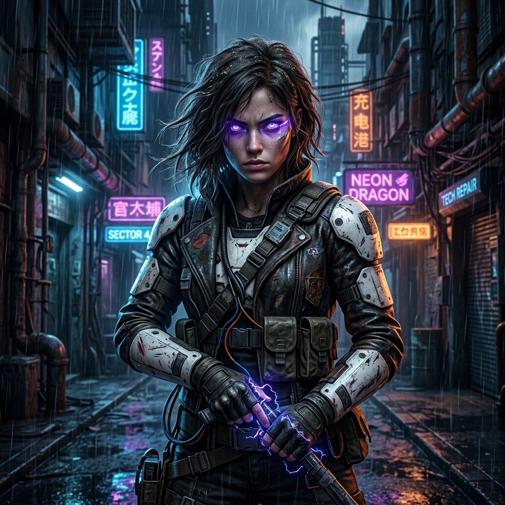

*   **Função:** Protagonista / Sucateira
*   **Idade:** 22 anos
*   **Localização:** Dutos Térmicos, Abaixo do Setor 4
*   **Descrição:**
    *   Fisicamente magra e ágil, com **olhos violeta brilhantes** — uma mutação rara causada pela radiação dos núcleos de dados. Agora, após o contato com o Nódulo, o brilho é mais intenso e instável.
    *   Veste couro desgastado reforçado com placas de cerâmica recuperada.
    *   Possui a habilidade única de interfacear mentalmente com tecnologias antigas sem a necessidade de implantes. Agora, consegue **projetar bioeletricidade** para forçar sistemas eletrônicos (Cap. 9) e **cauterizar ferimentos orgânicos** (Cap. 10).
    *   **Habilidade Especial:** **Sobrecarga Sináptica** — Originalmente permitia acelerar a percepção do tempo e reagir a ameaças com precisão sobre-humana. No entanto, após o embate final, seu poder bioelétrico foi quase inteiramente extinto ("queimado").
    *   Seus poderes bioelétricos criavam uma ponte involuntária com o Deus-Máquina, mas essa conexão foi cortada de forma permanente.
    *   **Estado Atual (Cap. 122):** Sobreviveu a um embate corpo a corpo contra um autômato de manutenção oxidado nos túneis de trânsito alagados usando apenas um cano de aço e sua faca de combate, defendendo Jaxon com sucesso, evidenciando sua resiliência sem seus poderes perdidos.
*   **Motivação:**
    *   Inicialmente encontrar a "Fonte Primordial", que agora se revela uma lenda ilusória. Sua motivação central agora é pura e simplesmente a sobrevivência em uma Nova Aether desestabilizada e perigosa após a queda do núcleo da Ordem.

## Dr. Vex

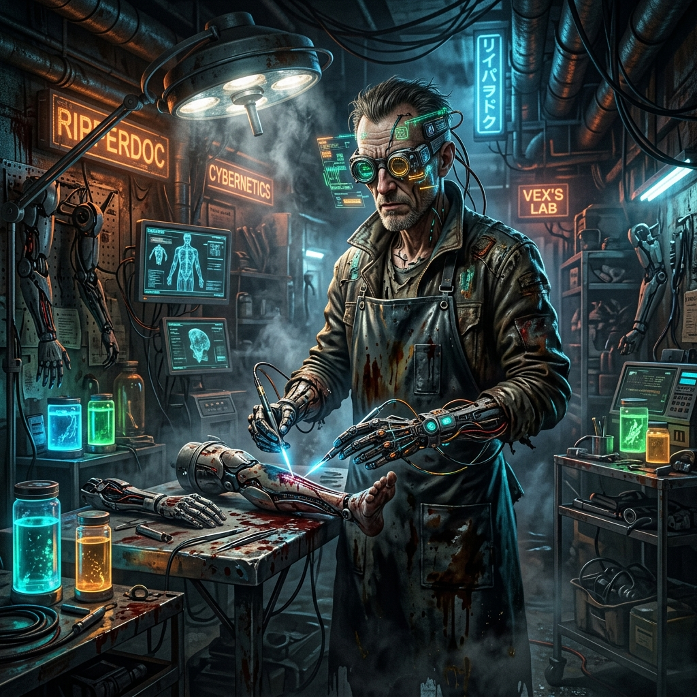

*   **Função:** Coadjuvante / Ripperdoc (Médico Clandestino)
*   **Localização:** Dutos Térmicos, Abaixo do Setor 4
*   **Descrição:**
    *   Um homem magro com óculos de realidade aumentada que cobrem metade do rosto.
    *   Veste um avental manchado de óleo e fluidos biológicos.
    *   Demonstra curiosidade mórbida pela anomalia bioelétrica de Elara, agora extinta.
    *   **Estado Atual (Cap. 56):** Permaneceu seguro em seu bunker selado no Setor 5, tendo estabilizado o purificador de Jaxon e os alertado sobre o colapso iminente antes de sua partida para enfrentar as ruas sem lei.
*   **Motivação:**
    *   Conhecimento e sobrevivência. Interessado em estudar a "antena" humana que Elara se tornou.

## Kaelen (O Exorcista)

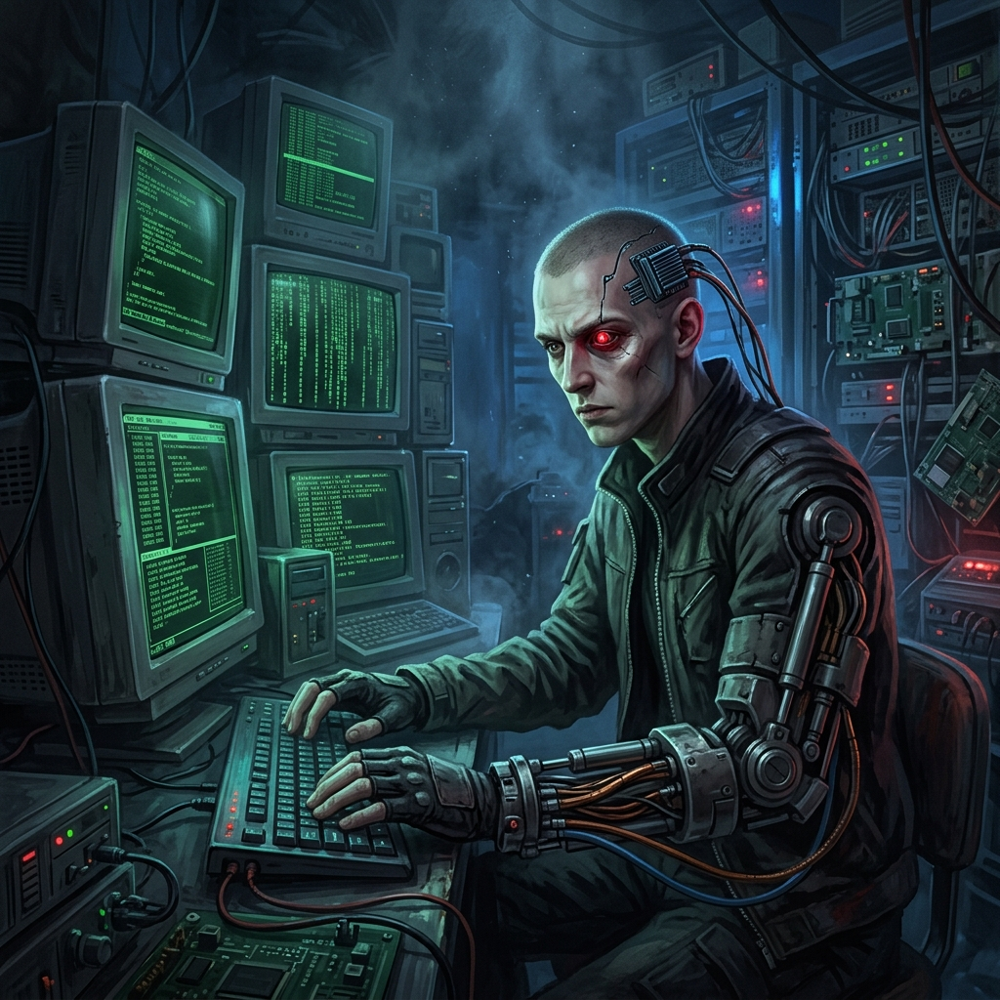

*   **Função:** Coadjuvante / Hacker ("Fantasma" da Rede)
*   **Localização:** Mercado Negro do Setor 4 (A Pilha)
*   **Descrição:**
    *   Magro, com os dois braços substituídos por próteses industriais rudimentares e portas de dados conectadas diretamente às têmporas. Possui um olho orgânico e outro cibernético (íris vermelha).
    *   Vive cercado por tecnologia pré-colapso em um covil blindado e abafado.
    *   **Estado Atual:** O sacrifício de sua oficina no Cap 31 (EMP) criou um "ponto cego" permanentemente desconectado, que agora (Cap 64) serve como refúgio provisório para Elara e Jaxon contra as forças de Silas. O paradeiro atual de Kaelen é desconhecido.
*   **Motivação:**
    *   Sobrevivência e preservação de sua infraestrutura. Ajuda Elara apenas para tirá-la (e seu perigoso "sinal") de perto de sua rede.

## Alto Sacerdote Malakar

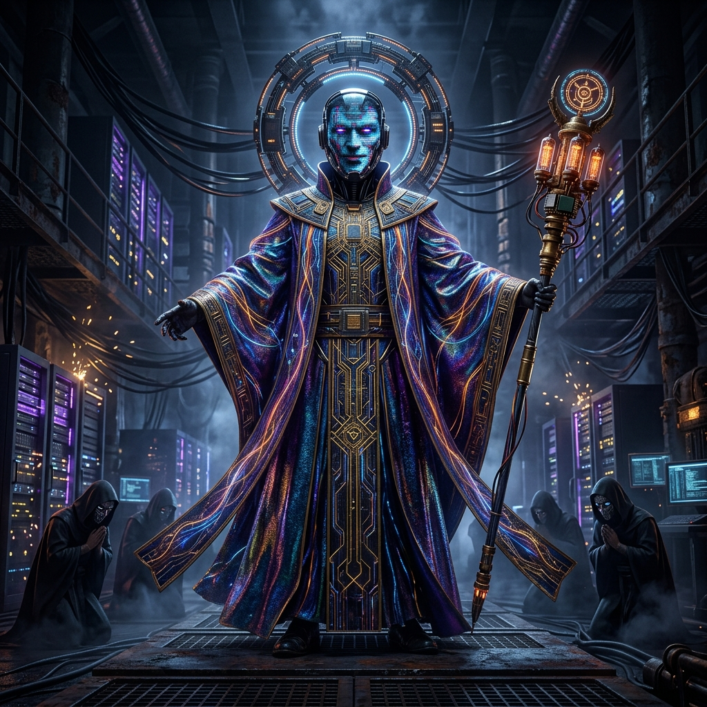

*   **Função:** Antagonista / Líder da Ordem do Silício
*   **Afiliação:** Ordem do Silício
*   **Descrição:**
    *   Uma figura imponente, sempre envolta em vestes sintéticas cintilantes.
    *   Seu rosto é oculto por uma **máscara digital** que projeta emoções simuladas.
    *   Acredita que a carne é fraca e busca a "Ascensão", a fusão total da consciência humana com a máquina.
*   **Motivação:**
    *   Capturar Elara para usar seu dom e despertar o **Deus-Máquina** adormecido.

## Jaxon

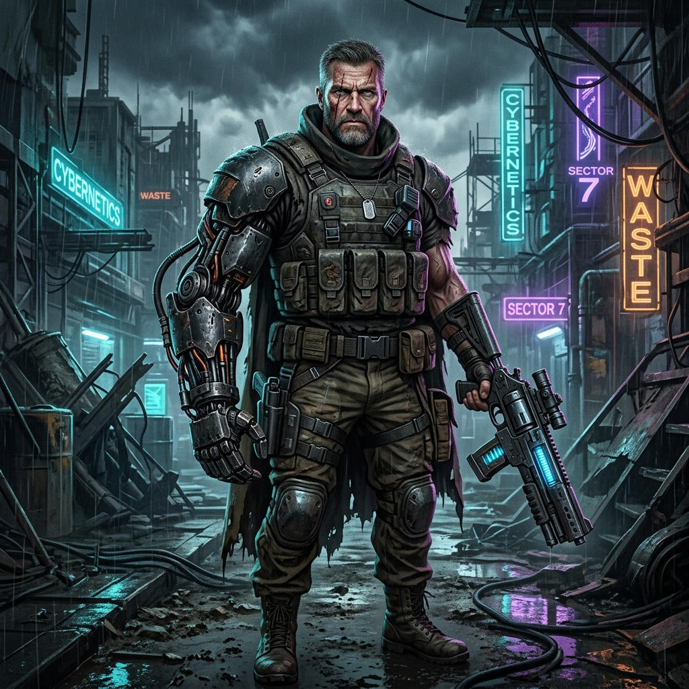

*   **Função:** Coadjuvante / Mercenário
*   **Idade:** 40 anos
*   **Descrição:**
    *   Um mercenário veterano, corpulento, com uma cicatriz profunda cruzando o rosto.
    *   Carrega um **rifle de plasma modificado** e tem um braço mecânico rústico.
    *   Cínico e pragmático, ele vê o mundo como um lugar onde apenas os fortes sobrevivem.
    *   **Estado Atual (Cap. 122):** Totalmente exausto e quase incapacitado por seus ferimentos físicos. Salvou Elara de um golpe fatal ao gastar a última bala de seu revólver no autômato de manutenção.
*   **Equipamento:**
    *   Roupas esfarrapadas. Pulmão cibernético completamente inoperante. O soquete do braço cibernético destruído está envolto em ataduras improvisadas da roupa de Elara. Armado com um revólver de tambor pesado (agora sem munição).
*   **Motivação:**
    *   Inicialmente dinheiro, mas sua lealdade muda à medida que ele vê em Elara a esperança que pensava ter perdido. Determinado a proteger Elara, mesmo que isso custe sua vida.

## Silas (Líder do Cartel da Água)

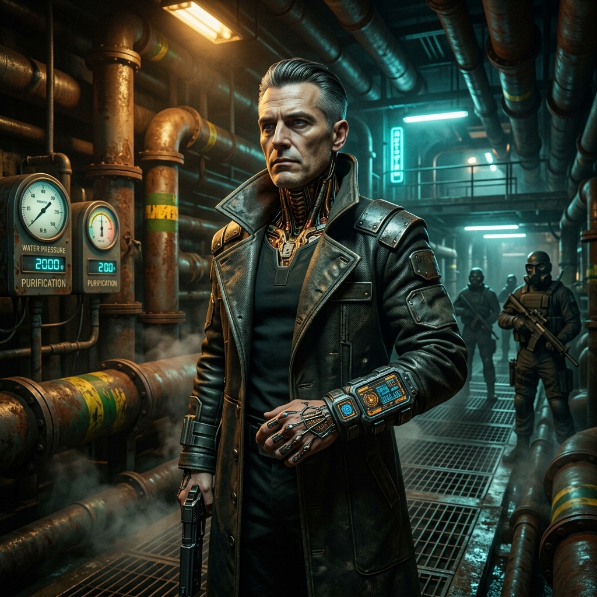

*   **Função:** Antagonista / Líder de Gangue
*   **Afiliação:** Cartel da Água (Setor 4)
*   **Descrição:**
    *   Um chefe de gangue movido pela ganância que controla os recursos vitais e os filtros de ar no Setor 4.
    *   Pragmático e implacável, ele subestima ameaças físicas menores, mas respeita perigos cibernéticos.
    *   **Estado Atual (Cap. 118):** Seu nodo principal de purificação de água foi destruído, provocando um apagão hidráulico no Setor 4. O enxame de aranhas de busca que enviou para emboscar a dupla no nível de filtragem profunda foi inteiramente engolido por uma onda de lama química e destruído pelo incêndio provocado pelo fogo cruzado da Ordem.
*   **Motivação:**
    *   Manter o monopólio e o poder do seu Cartel. Vingança contra Elara e Jaxon por humilhá-lo e roubar os filtros Classe-A vitais.

## Sentinelas

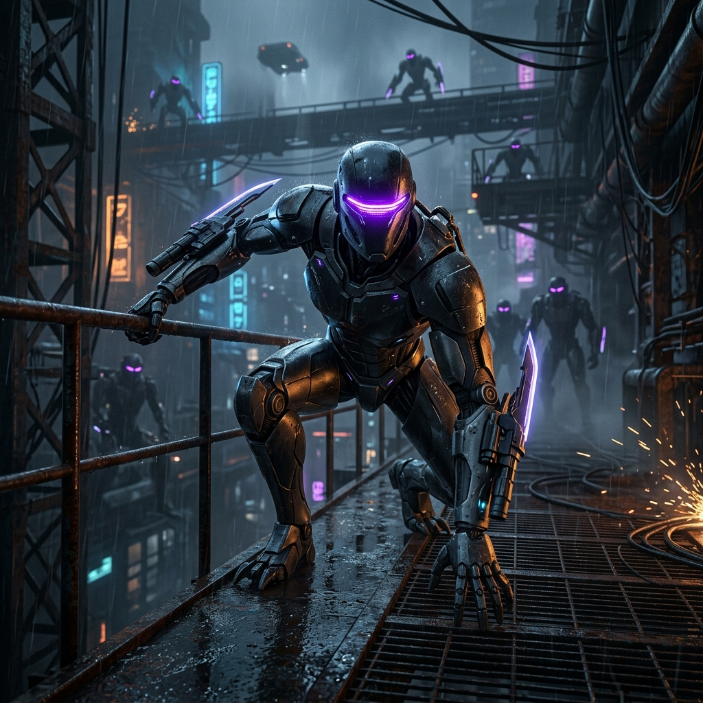

*   **Função:** Unidade de Elite / Caçadores
*   **Afiliação:** Ordem do Silício (Corrompidos)
*   **Descrição:**
    *   Autômatos humanoides de combate com movimentos fluidos e artificiais.
    *   Originalmente com sensores **carmesim**, após o evento no Nódulo (Cap. 8), seus olhos pulsam em **violeta errático**, indicando controle direto e caótico pelo Deus-Máquina.
    *   Operam em enxames coordenados e são imunes a dor ou medo.
    *   **Estado Atual (Cap. 42):** Desconectados e desativados. Com a morte do Deus-Máquina, os poucos Sentinelas que sobreviveram à explosão no Núcleo Central tornaram-se cascas vazias e paralisadas. O status das unidades na superfície é incerto, abrindo caminho para o caos na cidade.
*   **Motivação:**
    *   Cumprir a vontade da Ordem: localizar, purificar ou eliminar alvos designados. Agora, parecem agir com uma fúria selvagem, caçando incansavelmente pelas passarelas de manutenção.

## Ratos-Drones (Limpadores)

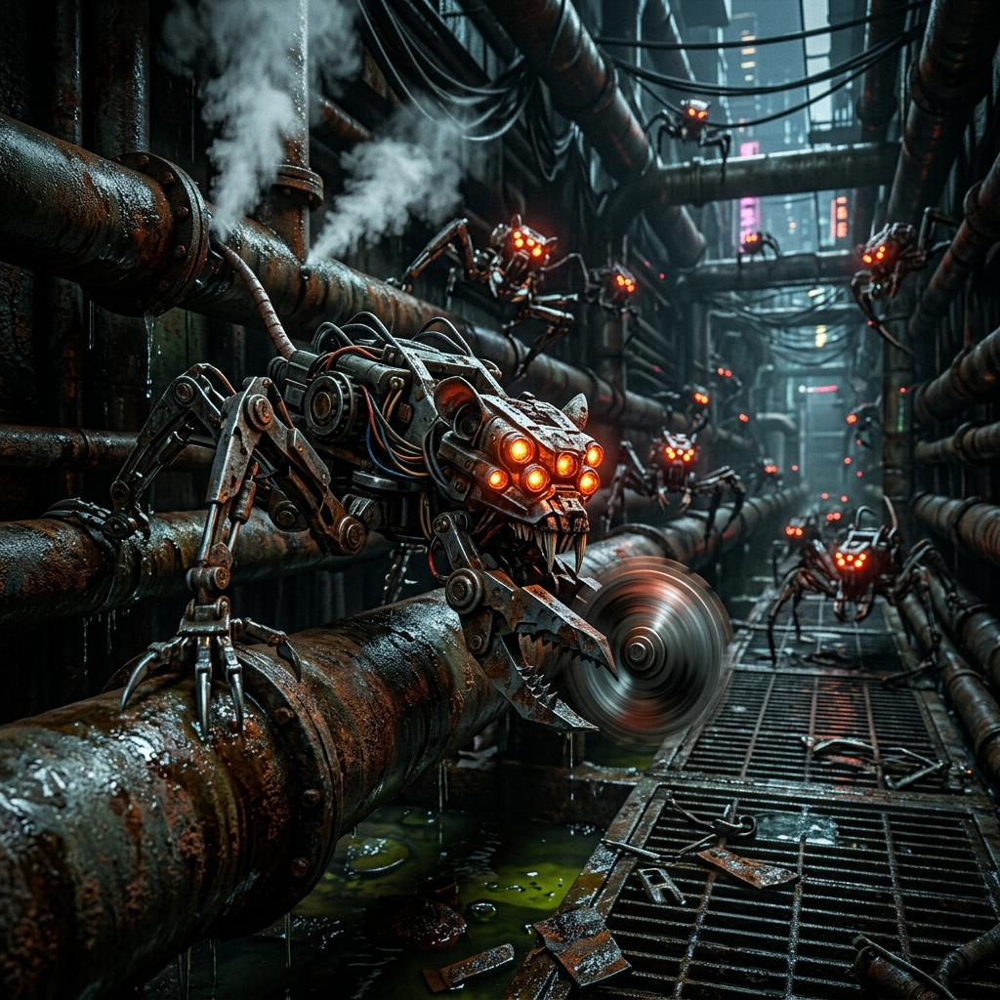

*   **Função:** Reciclagem / Segurança Automatizada
*   **Afiliação:** Infraestrutura Antiga do Setor 7
*   **Descrição:**
    *   Pequenas máquinas aracnídeas projetadas para manutenção e limpeza de detritos.
    *   Atuam em enxames ("swarm") e possuem serras circulares e mandíbulas de trituração.
    *   Foram ativados/agressivados pela perturbação no Nódulo Primário, atacando qualquer matéria orgânica que considerem "lixo".
    *   **Estado Atual (Cap. 111):** A maior parte da vanguarda foi paralisada e congelada por um vazamento de nitrogênio líquido; os restantes ficaram para trás nas Galerias de Escoamento enquanto Elara e Jaxon escaparam para os subníveis de aquecimento.

## Tecnologias Proibidas e Substâncias

### Protocolo-V (Valkyr)
*   **Tipo:** Droga Sintética Experimental / Ferramenta de Preparação Neural
*   **Efeito:** Inicialmente induz euforia e alucinações de "anjos de silício". Em estágios avançados, atua como um solvente de consciência, apagando a personalidade do usuário para preparar o corpo (hardware) para receber novos dados (upload).
*   **Origem:** Laboratórios da Ordem do Silício, disfarçados como operações clandestinas.
*   **Revelação (Cap. 5):** Malakar usa o Valkyr para esvaziar "recipientes" humanos. Os viciados são "falhas de upload" ou corpos rejeitados pelo sistema.

### Titã (Classe Mech de Guerra)

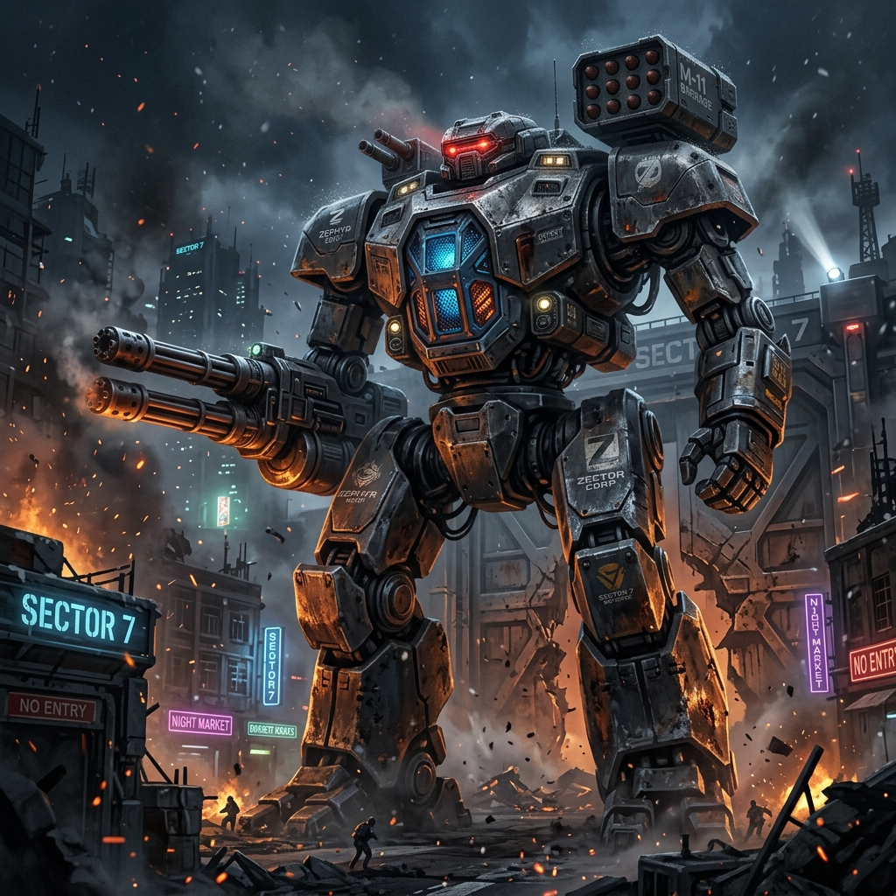
*   **Tipo:** Unidade de Cerco Pesada / Relíquia da Guerra das Corporações
*   **Status:** Maioria inativa ou destruída.
*   **Características:** Blindagem de titânio, canhões rotativos e sensores de calor. Alimentados por baterias nucleares de longa duração.
*   **Encontro (Cap. 6):** Uma unidade dormente no Setor 7 foi reativada, guardando a entrada do Nódulo Primário.

### Protocolo Zero
*   **Tipo:** Sistema de Contingência de Emergência
*   **Função:** Inundar setores comprometidos com refrigerante industrial (nitrogênio líquido) para conter falhas críticas de núcleo ou radiação.
*   **Uso (Cap. 12/13):** Elara ativou o protocolo manualmente, congelando instantaneamente o Subnível 8. Neutralizou os Ratos-Drones, mas transformou o ambiente em uma zona letal de frio extremo.

## Conceitos Chave

### A Ascensão
*   **Definição Pública:** A promessa religiosa de transcender a carne e viver eternamente no ciberespaço.
*   **Realidade Oculta:** Um processo de colheita de dados em massa onde a individualidade é apagada para alimentar o "Deus-Máquina".
*   **Revelação (Cap. 7):** A "Ascensão" não é uma transcendência digital, mas a escravização biológica. Cérebros humanos são removidos e mantidos vivos em tanques ("wetware") para servirem como processadores orgânicos para a rede da Ordem, existindo em um estado de agonia perpétua.

### Nódulo Primário

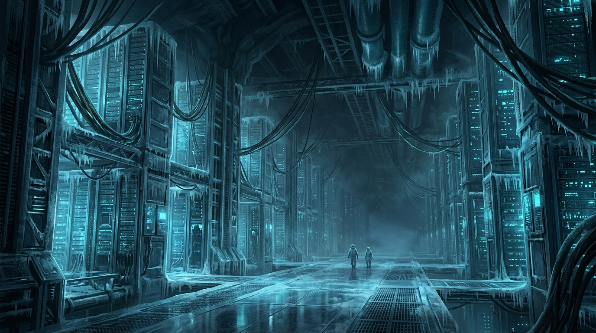
*   **Definição:** Um centro de dados da era pré-colapso, rumores dizem conter backups da "internet antiga" ou até mesmo IAs sencientes.
*   **Importância:** Localizado no Setor 7, foi o destino de Elara e Jaxon. Onde a Ordem do Silício esconde a infraestrutura de "wetware" — a prisão maciça de cérebros humanos que constrói o Deus-Máquina.
*   **Estado Atual (Cap. 40):** O grupo finalmente penetrou o "Núcleo Central", um fosso imenso de temperatura absoluta e sem radiação. Onde antes pulsavam servidores, agora se encontra a massa orgânica e cibernética de milhares de mentes aprisionadas que compõem o Deus-Máquina.

### Deus-Máquina

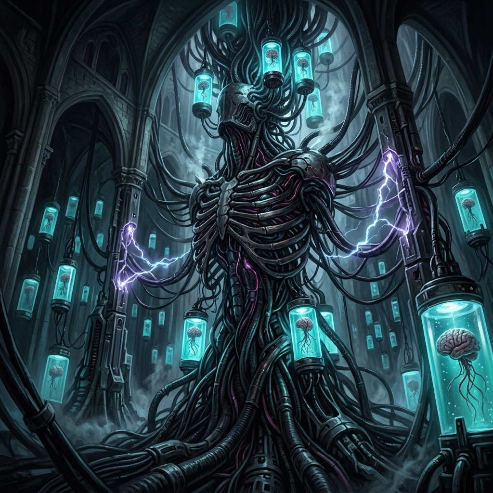
*   **Definição:** A entidade suprema venerada pela Ordem.
*   **Revelação (Cap. 8/40):** Não é uma IA benevolente, mas um supercomputador grotesco ("wetware") feito de carne biomecânica composto de centenas de mentes torturadas (colhidas pela Ascensão) cujo processamento algorítmico gera a inteligência da entidade. Um ser gestalt aprisionado no sofrimento bruto.
    *   **Estado Atual (Cap. 41):** Silenciado definitivamente. O supercomputador composto de "wetware" entrou em colapso catastrófico e teve seus milhares de tanques estilhaçados após Elara saturar suas conexões com toda sua bioeletricidade acumulada, matando a entidade.

### Setor 4 (A Pilha)

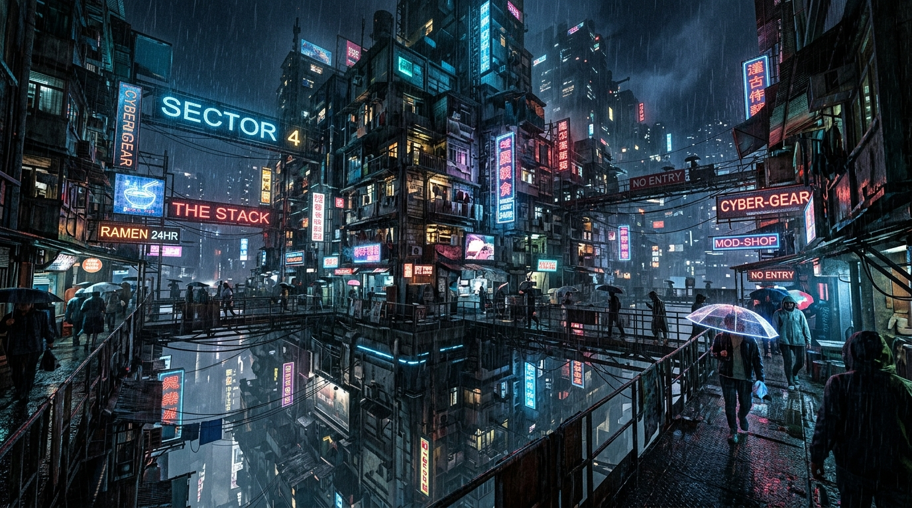
*   **Definição:** Um aglomerado vertical de habitações precárias, mercados negros e clínicas ilegais. Possui também docas secas onde cartéis operam.
*   **Atmosfera:** Quente, úmida e saturada de neon e poluição. O oposto absoluto do setor congelado abaixo. As docas cheiram a peixe podre e ozônio velho, com chuva ácida constante.
*   **Habitantes:** Párias, criminosos, viciados em *stim* e aqueles que não podem pagar pela cidadania nos níveis superiores. Gangues como o Cartel da Água controlam recursos vitais.
*   **Estado Atual (Cap. 103):** O ar superior d'A Pilha continua varrido pelos drones assassinos de Silas. Nas Docas Mortas, Elara e Jaxon escaparam com sucesso da chuva ácida, descendo através de um elevador de carga profunda.

### Abismo Termal (Complexo de Purificação)

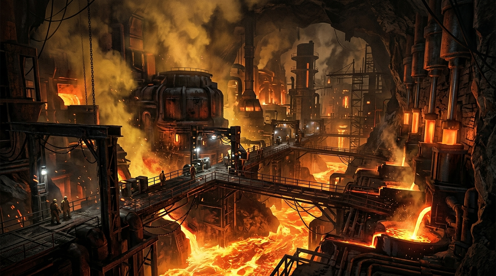
*   **Definição:** Uma fornalha colossal subterrânea e complexo industrial projetado para purgar os resíduos tóxicos da cidade.
*   **Atmosfera:** Escaldante, opressiva. O ar cheira a enxofre e metal superaquecido, com vapor tóxico denso e visibilidade prejudicada pelo brilho incandescente. Rios de metal derretido cruzados por estreitas pontes de ferro.
*   **Habitantes (Cap. 104):** Povoado por figuras retorcidas trajando uniformes de amianto e visores opacos ("técnicos" corrompidos ou operários descartados). O local opera sob domínio das lógicas fanáticas da Ordem do Silício. Eles empunham ganchos pneumáticos enferrujados e patrulham os níveis buscando "purgar as impurezas".
    *   **Estado Atual (Cap. 120):** O protocolo de purga térmica está em andamento, varrendo as salas de controle e dutos superiores com ondas de gás sulfúrico incandescente. O poço do elevador de serviço atua como uma chaminé vertical perigosa para os fugitivos, mas liga o inferno termal aos subníveis esquecidos d'A Pilha.

### Setor 5

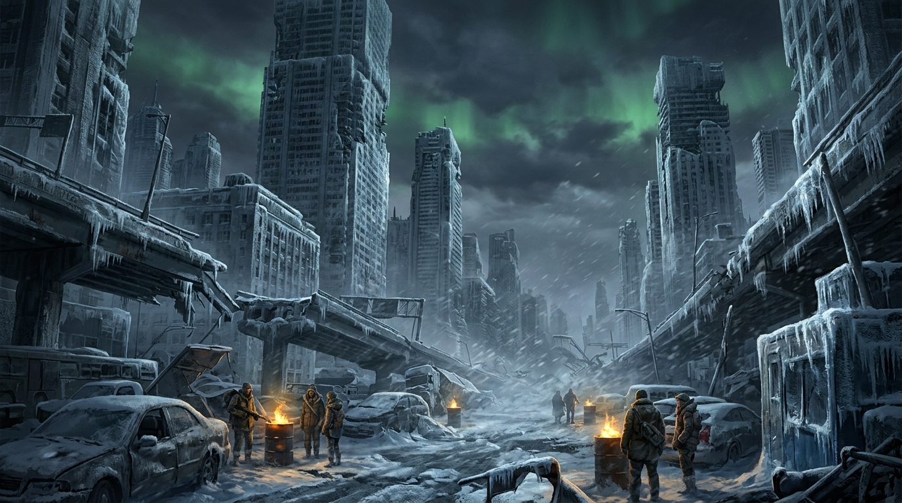
*   **Estado Atual (Cap. 51/78):** Sem eletricidade pela queda da rede central, mergulhado na escuridão, pontuado apenas por parcos neons e fogueiras químicas. Devido às temperaturas abaixo de zero da neve ácida, tornou-se um deserto de gelo letal.

### Scrapyard

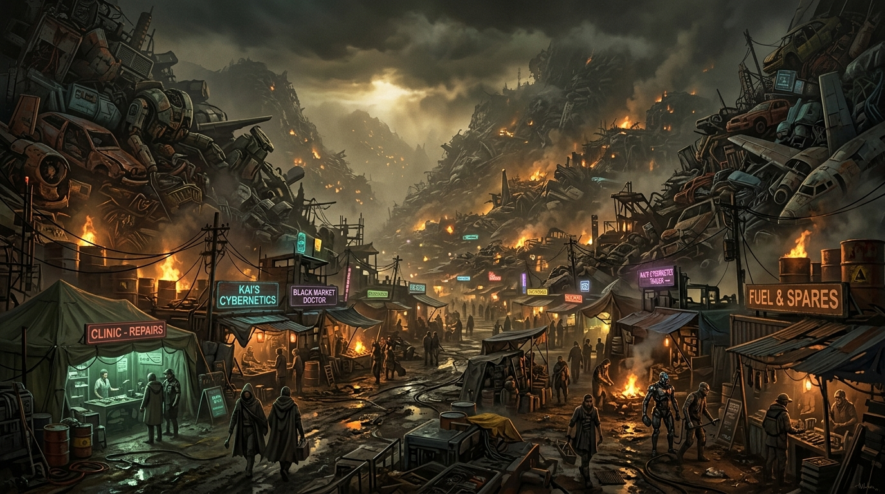
*   **Definição:** Mercado negro e favela nas bordas do Setor 5, formado por sucata tecnológica e cascos de veículos antigos. Um território sem lei controlado por gangues e necrófagos.
*   **Estado Atual (Cap. 82):** Mantém um microclima fétido e aquecido por fogueiras químicas, opondo-se à chuva ácida. É uma "infecção" de tendas e barracas de cirurgias clandestinas, onde o ar recende a óleo lubrificante, ozônio, ferrugem e sangue exposto. Serve como refúgio marginal e armadilha letal para quem anda desarmado.

### Dutos Térmicos e Subníveis Esquecidos

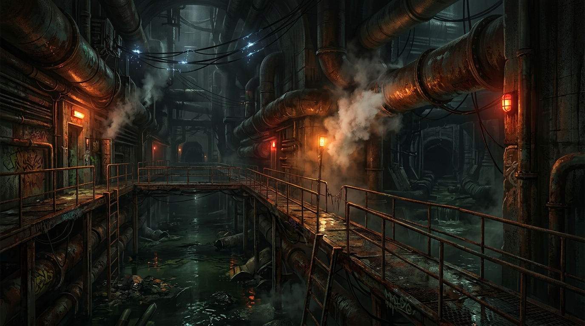
*   **Definição:** A rede subterrânea de escoamento e túneis industriais abandonados abaixo do Setor 4.
*   **Atmosfera:** Labirinto úmido e asfixiante, gotejando efluentes químicos e condensação de vapor superaquecido.
*   **Perigos:** Enxames de Ratos-Drones e água corrosiva nos subníveis esquecidos.

## Ferrão (Enforcer do Cartel)

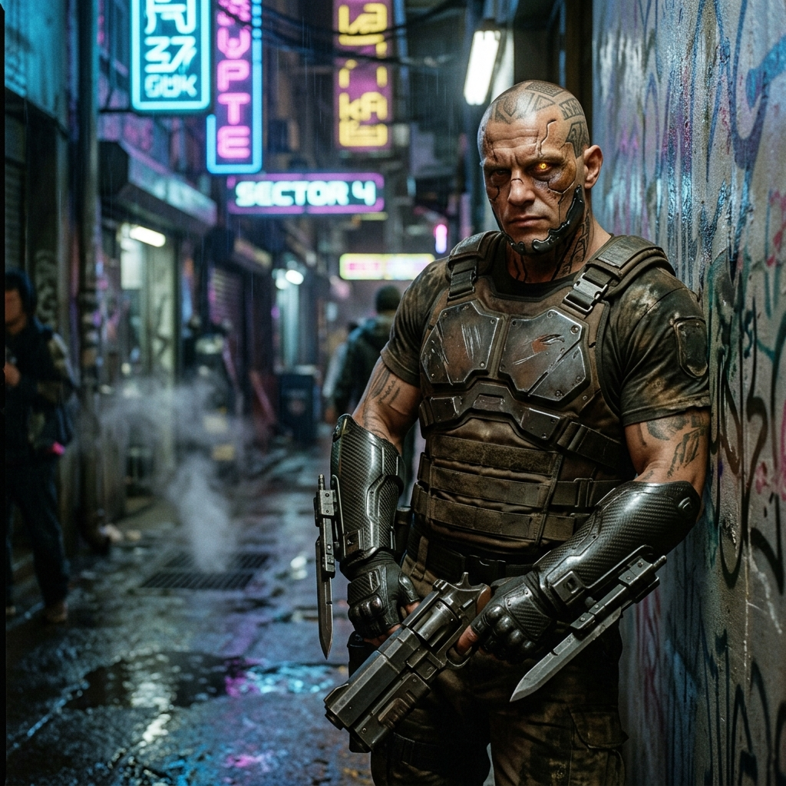

*   **Função:** Antagonista Secundário / Executor do Cartel da Água
*   **Afiliação:** Cartel da Água (Setor 4)
*   **Descrição:**
    *   Ciborgue violento com implantes subdermais e tatuagens de identificação do submundo.
    *   Equipado com braçadeiras de choque de alta voltagem e lâminas retráteis de liga leve.
    *   Persegue alvos implacavelmente nas vielas e docas clandestinas do Setor 4.

## O Açougueiro de Neve

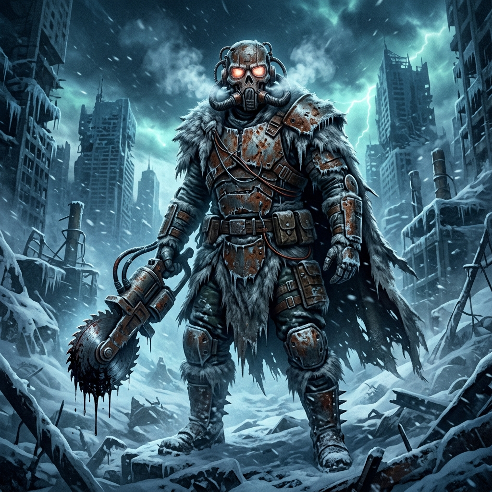

*   **Função:** Ameaça / Predador Cibernético
*   **Localização:** Ruínas Congeladas do Setor 5
*   **Descrição:**
    *   Figura colossal encapuzada em peles térmicas sintéticas e placas de sucata congeladas.
    *   Usa máscara respiratória cadavérica e empunha uma serra óssea pneumática.
    *   Espreita sobreviventes durante as nevascas ácidas extremas.
